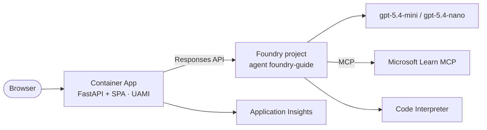

# Microsoft Foundry — Session kit (90 min)

[](https://github.com/frkim/foundry-demo/actions/workflows/ci.yml)
[](https://github.com/frkim/foundry-demo/actions/workflows/deploy.yml)
[](https://github.com/frkim/foundry-demo/actions/workflows/deck.yml)
[](LICENSE)

Everything needed to deliver a 90-minute session on **Microsoft Foundry**: the slide deck, a timed narrative, a
recorded demo, and **Foundry Guide** — a live demo app built on Microsoft Foundry (new), Foundry Agent Service,
the Responses API, MCP, and keyless Azure deployment.

## What's inside

| Item | Location | Notes |
| --- | --- | --- |
| Slide deck | [`docs/presentations/`](docs/presentations/) | [Marp](https://marp.app/) Markdown, built and published by `deck.yml` |
| Session narrative | [`docs/session/`](docs/session/) | Pitch and timed talk track, demo runbook, Q&A preparation |
| Demo app | [`src/`](src/) | FastAPI API (`src/api`) + Vue 3/Vuetify SPA (`src/web`) in one container |
| Infrastructure | [`infra/`](infra/) | Bicep at subscription scope: Foundry resource + project, models, Container Apps, ACR, monitoring |
| Demo video | [`docs/video/foundry-demo.mp4`](docs/video/foundry-demo.mp4) | Recorded walkthrough with subtitles; reproducible via [`scripts/video/`](scripts/video/) |
| Architecture | [`docs/architecture.md`](docs/architecture.md) | Mermaid component and sequence diagrams |
| Decisions | [`docs/adr/`](docs/adr/README.md) | ADRs, including preview features and a time-boxed exception |

**Session agenda** — opening and why Foundry · platform tour · agents, tools, and MCP · **demo: Foundry Guide** ·
observability, evaluations, safety, and governance · **AI Gateway** · deploy and DevOps · roadmap and Q&A.

The AI Gateway segment (Azure API Management in front of Foundry: token limits, load balancing, MCP governance) is
demonstrated with [frkim/apim-demo](https://github.com/frkim/apim-demo) and
[Azure-Samples/AI-Gateway](https://github.com/Azure-Samples/AI-Gateway).

**Demo 3 — Foundry capabilities** adds ten short, independent demos: Foundry IQ + Knowledge, MCP/A2A connectivity,
model router, guardrails and prompt injection, skills and reusable tools, durable and autonomous agents, continuous
observability, evaluation and optimization, LangSmith/LangGraph/Deep Agents, and human in the loop — see the
[demo runbook](docs/session/demo-runbook.md#demo-3--foundry-capabilities-ten-short-demos).

### The Foundry Guide demo

- **Agent chat** — the `foundry-guide` agent (`gpt-5.4-mini`) answers Foundry questions using the
  [Microsoft Learn MCP server](https://learn.microsoft.com/training/support/mcp) and Code Interpreter, showing tool
  calls as chips.
- **Model compare** — the same prompt on `gpt-5.4-mini` and `gpt-5.4-nano` side by side, with latency and tokens.
- **Run history** — searchable, sortable, filterable, paginated table of recent runs.
- **About** — architecture overview; dark/light theme toggle throughout.

## Prerequisites

- Python 3.13 and [`uv`](https://docs.astral.sh/uv/)
- Node.js 24 LTS and npm
- Azure CLI with Bicep (`az bicep install`)
- Access to a Foundry project with `gpt-5.4-mini` and `gpt-5.4-nano` deployments and the **Azure AI User** role

Packages install from the Microsoft-protected feeds configured in the repository
(`packagefeedproxy.microsoft.io` for PyPI and npm) — see
[package feeds](https://github.com/frkim/ai-coding-standards/blob/main/standards/development/package-feeds.md).
Do not point them at a public registry.

## Quickstart (local)

```bash
# 1. Sign in — the app is keyless and uses your Azure CLI identity locally
az login

# 2. Configure the API
cp .env.example src/api/.env   # then set FOUNDRY_PROJECT_ENDPOINT (PowerShell: Copy-Item)

# 3. Build the SPA
cd src/web
npm ci
npm run build

# 4. Run the API (serves the SPA) on http://localhost:8000
cd ../api
uv sync
uv run uvicorn foundry_demo.main:app --reload --port 8000
```

For frontend hot reload, run `npm run dev` in `src/web` alongside the API.

### Quality gates

```bash
(cd src/api && uv run ruff check && uv run mypy && uv run pytest)
(cd src/web && npm ci && npm run build)
(cd docs/presentations && npm ci && npm run build:all)
az bicep lint --file infra/main.bicep
```

## Deploy

The [`deploy.yml`](.github/workflows/deploy.yml) workflow deploys `infra/main.bicep` at subscription scope, builds
and pushes the image to ACR, and rolls out a new Container App revision. Configure the repository:

| Kind | Name | Value |
| --- | --- | --- |
| Variable (OIDC, preferred) | `AZURE_CLIENT_ID` | Client ID of the deploying app registration with a federated credential |
| Variable (OIDC, preferred) | `AZURE_TENANT_ID` | Microsoft Entra tenant ID |
| Variable (OIDC, preferred) | `AZURE_SUBSCRIPTION_ID` | Target subscription ID |
| Secret (fallback) | `AZURE_CREDENTIALS` | Service principal JSON — used only when `AZURE_CLIENT_ID` is not set |
| Variable (optional) | `AZURE_LOCATION` | Azure region for Foundry, ACR, and monitoring; default `swedencentral` |

The Container Apps environment region comes from `appLocation` in
[`infra/main.dev.bicepparam`](infra/main.dev.bicepparam). It is currently `francecentral` because Container Apps capacity
in `swedencentral` was constrained.

The secret fallback is a time-boxed exception (expires 2026-12-31) with migration steps to OIDC in
[ADR-0003](docs/adr/0003-github-actions-azure-auth-exception.md).

Run it from **Actions → deploy → Run workflow**, or push to `main`. The workflow summary shows the app URL.

## Architecture



Details, including the request sequence, are in [`docs/architecture.md`](docs/architecture.md).

## Repository structure

```text
.github/             workflows (ci, deploy, deck), templates, Dependabot, CODEOWNERS
docs/adr/            architecture decision records
docs/presentations/  Marp slide deck
docs/session/        narrative, demo runbook, Q&A prep
docs/video/          demo video and subtitles
infra/               Bicep (main.bicep, modules/, main.dev.bicepparam)
scripts/video/       reproducible video pipeline
src/api/             FastAPI backend (uv)
src/web/             Vue 3 + Vuetify SPA (Vite)
src/Dockerfile       multi-stage container image
AGENTS.md            contract for AI coding agents
```

## Security

- Keyless end to end at runtime: user-assigned managed identity, `DefaultAzureCredential`, and `disableLocalAuth` on
  the Foundry resource — no API keys.
- No secrets in the repository; [`.env.example`](.env.example) holds placeholders only.
- Report vulnerabilities privately as described in [`SECURITY.md`](SECURITY.md).

## Contributing and help

See [`CONTRIBUTING.md`](CONTRIBUTING.md) and [`AGENTS.md`](AGENTS.md). For questions or problems,
[open an issue](https://github.com/frkim/foundry-demo/issues/new/choose). This repository follows the
[ai-coding-standards](https://github.com/frkim/ai-coding-standards).

## License

[MIT](LICENSE)
