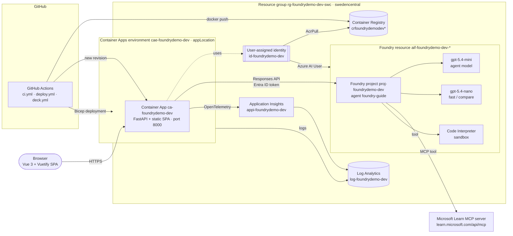
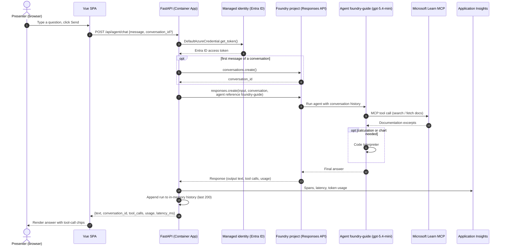

# Architecture

The **Foundry Guide** demo is a single container on Azure Container Apps that serves a Vue 3/Vuetify SPA and a
FastAPI backend. The backend calls a Microsoft Foundry (new) project keylessly through a user-assigned managed
identity. Infrastructure is Bicep at subscription scope, deployed by GitHub Actions. Decisions are recorded in
[`adr/`](adr/README.md).

## Components

| Component | Purpose |
| --- | --- |
| Container App | Serves the SPA and the API (`/api/agent/chat`, `/api/models/compare`, `/api/history`, `/api/info`, `/health/*`). Scales to zero. The Container Apps environment is deployed to `appLocation` (parameter, defaults to `location`). The dev environment uses `francecentral` because Container Apps capacity in `swedencentral` was constrained (`AKSCapacityHeavyUsage`). Foundry, ACR, and monitoring stay in `swedencentral`. |
| User-assigned managed identity | Pulls the image (AcrPull) and calls Foundry (Azure AI User). `AZURE_CLIENT_ID` selects it for `DefaultAzureCredential`. |
| Foundry resource + project | Kind `AIServices`, `allowProjectManagement: true`, `disableLocalAuth: true`. Hosts the `foundry-guide` agent and both model deployments. |
| Microsoft Learn MCP server | Public, read-only documentation tools for grounding ([ADR-0005](adr/0005-mcp-tool-microsoft-learn.md)). |
| Code Interpreter | Sandboxed Python for calculations and charts ([ADR-0004](adr/0004-preview-features.md)). |
| Application Insights / Log Analytics | Traces (including OpenAI/agent spans), logs, and metrics. |
| GitHub Actions | CI (lint, type check, test, build, Bicep lint), deployment, and deck publishing ([ADR-0003](adr/0003-github-actions-azure-auth-exception.md) for Azure auth). |

## Agent chat request

## Configuration

The app reads its configuration from environment variables (see [`.env.example`](../.env.example)):
`FOUNDRY_PROJECT_ENDPOINT`, `FOUNDRY_MODEL_DEPLOYMENT`, `FOUNDRY_FAST_MODEL_DEPLOYMENT`, `FOUNDRY_AGENT_NAME`,
`AZURE_CLIENT_ID`, `APPLICATIONINSIGHTS_CONNECTION_STRING`, and `APP_VERSION`. Bicep sets them on the Container App;
the deploy workflow sets `APP_VERSION` to the git SHA.
