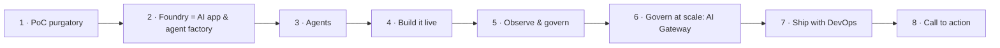

# Session kit — Microsoft Foundry: from AI pilot to production agents (90 min)

Everything a presenter needs to deliver the 90-minute Microsoft Foundry technical session with the **Foundry Guide**
demo app and the **AI Gateway** demo.

| File | What it is | When you use it |
| --- | --- | --- |
| [pitch.md](pitch.md) | Elevator pitch, 2-minute pitch, catalog abstract, title options, audience, prerequisites, takeaways, call to action | Event submission, host intro, promotion |
| [narrative.md](narrative.md) | Full timed talk track (8 sections, 00:00–01:30) with script, transitions, polls, and time checks | Rehearsal and delivery |
| [demo-runbook.md](demo-runbook.md) | Step-by-step Demo 1 (Foundry Guide, 15 min), Demo 2 (AI Gateway, 10 min) and Demo 3 (ten short Foundry capability demos, 3–6 min each), setup, fallbacks, reset | T-1 day dry run and on stage |
| [demo3/](demo3/README.md) | Demo 3 assets: knowledge-base documents (one with a deliberate prompt injection), evaluation queries, a sample skill | Demo 3 setup |
| [qa-prep.md](qa-prep.md) | 27 anticipated questions with crisp, sourced answers and uncertainty flags | Q&A and hallway conversations |

> **Fact hygiene.** Microsoft Foundry changes monthly. Statements in this kit are tied to a dated source; anything
> marked **[verify]** must be re-checked on Microsoft Learn before you say it on stage. Re-read
> [ADR-0004](../adr/0004-preview-features.md) (preview features in use) before every delivery.

## Agenda at a glance

| # | Time | Section | Format |
| --- | --- | --- | --- |
| 1 | 00:00–00:10 | Opening & why Foundry | Talk + poll |
| 2 | 00:10–00:25 | Platform tour: models, catalog, Foundry resource/projects, new portal | Talk + portal glimpse |
| 3 | 00:25–00:40 | Agents: Agent Service, Agent Framework, tools, MCP, A2A, memory, hosted agents | Talk + code |
| 4 | 00:40–00:55 | **DEMO 1 — Foundry Guide agent** | Live demo |
| 5 | 00:55–01:05 | Observability, evaluations, safety, Foundry Control Plane | Talk |
| 6 | 01:05–01:15 | **AI Gateway (APIM)** — token limits, load balancing, MCP governance — **DEMO 2** | Talk + live demo |
| 7 | 01:15–01:20 | Deploy & DevOps: Bicep + GitHub Actions + keyless | Talk + repo walk-through |
| 8 | 01:20–01:30 | Roadmap, resources, Q&A | Talk + Q&A |

**Demo 3 — Foundry capabilities** is a modular track of ten short demos: Foundry IQ + Knowledge, MCP/A2A
connectivity, model router, guardrails and prompt injection, skills and reusable tools, durable and autonomous agents,
continuous observability, evaluation and optimization, LangSmith/LangGraph/Deep Agents, and human in the loop. Run all
of them after section 5 in an extended format (≈ 45 min), or show **3.1 Foundry IQ** plus one or two others inside the
90 minutes.



## Materials

| Material | Location | Notes |
| --- | --- | --- |
| Slide deck (Marp source) | [`docs/presentations/foundry-session.md`](../presentations/foundry-session.md) | Same 8-section agenda; built by `deck.yml` |
| Architecture | [`docs/architecture.md`](../architecture.md) | Mermaid component + sequence diagrams |
| Decisions | [`docs/adr/`](../adr/README.md) | Especially ADR-0003 (deploy auth), ADR-0004 (preview features), ADR-0005 (Learn MCP) |
| Demo app source | [`src/`](../../src) | FastAPI backend (`src/api`) + Vue 3/Vuetify SPA (`src/web`) |
| Infrastructure | [`infra/`](../../infra) | Bicep, subscription scope, `main.dev.bicepparam` |
| Deployment pipeline | `.github/workflows/deploy.yml` | Bicep deploy + image build + new Container Apps revision |
| Recorded demo (offline fallback) | `docs/video/foundry-demo.mp4` (+ `.srt`) | Play from local disk — do not stream it |
| AI Gateway demo | <https://github.com/frkim/apim-demo> | Deploy the day before; see Demo 2 |
| Demo 3 assets | [`docs/session/demo3/`](demo3/README.md) | Knowledge-base documents, evaluation queries, sample skill |
| AI Gateway labs (reference) | <https://github.com/Azure-Samples/AI-Gateway> | Labs to point the audience to |

## Prep checklist

### T-7 days

- [ ] Rehearse the full [narrative](narrative.md) once with a timer; note where you run long.
- [ ] Re-check every **[verify]** item you plan to mention (model names, preview/GA badges, retirement dates) on
      Microsoft Learn; update the deck and [qa-prep.md](qa-prep.md) if anything changed.
- [ ] Confirm the subscription has **GlobalStandard** quota in `swedencentral` for `gpt-5.4-mini` and `gpt-5.4-nano`
      (capacity 50 each) — see the quota commands under T-1 hour.
- [ ] Confirm the deployment identity still works (ADR-0003: OIDC preferred; the secret fallback expires 2026-12-31).
- [ ] Deploy **frkim/apim-demo** end to end and run `python -m ai_gateway all` to validate Demo 2.
- [ ] Confirm `docs/video/foundry-demo.mp4` exists, plays offline, and matches the current UI.
- [ ] Send the organizer the [abstract](pitch.md#session-abstract-event-catalog) and [prerequisites](pitch.md#prerequisites).

### T-1 day

- [ ] Deploy the latest `main` through GitHub Actions:

  ```powershell
  az login
  az account set --subscription '<subscription-id>'
  gh auth status
  gh workflow run deploy.yml --repo frkim/foundry-demo --ref main
  Start-Sleep -Seconds 10
  $runId = gh run list --repo frkim/foundry-demo --workflow deploy.yml --limit 1 --json databaseId --jq '.[0].databaseId'
  gh run watch $runId --repo frkim/foundry-demo --exit-status
  ```

- [ ] Full dry run of [Demo 1 and Demo 2](demo-runbook.md) on the **presentation laptop**, on the **venue network**
      if possible. Time each demo.
- [ ] If you run Demo 3: complete its [pre-demo setup](demo-runbook.md#demo-3--pre-demo-setup-t-1-day) (model router
      deployment, Azure AI Search + `zava-kb`, `demo-guardrail`, routine, continuous evaluation rule, pre-run
      evaluation and optimizer) and dry-run the demos you selected.
- [ ] Verify the agent in the Foundry portal (<https://ai.azure.com> → project `proj-foundrydemo-dev` → Agents →
      `foundry-guide`) and that traces arrive in Application Insights `appi-foundrydemo-dev`.
- [ ] Re-validate apim-demo (`python -m ai_gateway chat`).
- [ ] Copy `docs/video/foundry-demo.mp4` to the laptop's local disk **and** a USB stick.
- [ ] Charge laptop; pack HDMI/USB-C adapters and clicker.

### T-1 hour

- [ ] **Deploy check** — the last `deploy.yml` run is green:
      `gh run list --repo frkim/foundry-demo --workflow deploy.yml --limit 1`.
- [ ] **Warm up the app** (Container Apps scales to zero; the first request is a cold start):

  ```powershell
  $fqdn = az containerapp show -n ca-foundrydemo-dev -g rg-foundrydemo-dev-swc --query properties.configuration.ingress.fqdn -o tsv
  curl.exe -s "https://$fqdn/health/live"     # {"status":"live"}
  curl.exe -s -i "https://$fqdn/health/ready" # must be 200 with the agent ready (503 = not ready)
  curl.exe -s "https://$fqdn/api/info"        # endpoint host, models, agent name/version, app version, region
  ```

  Then send one throw-away chat and one compare in the UI so the agent, MCP tool, and Code Interpreter are warm.
  Reset the run history afterwards if you want a clean table (see [reset steps](demo-runbook.md#reset-steps)).
- [ ] **Check quota / throttling** — deployments present, no recent 429s:

  ```powershell
  az cognitiveservices usage list --location swedencentral -o table
  $acct = az cognitiveservices account list -g rg-foundrydemo-dev-swc --query "[0].name" -o tsv
  az cognitiveservices account deployment list -g rg-foundrydemo-dev-swc -n $acct -o table
  ```

- [ ] **Open the tabs** (one browser window, zoom 125–150 %, in this order):
  1. Deck (presenter mode)
  2. Foundry Guide — `https://<containerAppFqdn>` (Agent chat tab)
  3. Foundry portal — <https://ai.azure.com> → project `proj-foundrydemo-dev` → Agents → `foundry-guide`
  4. Azure portal — Application Insights `appi-foundrydemo-dev` → Transaction search and Logs
  5. GitHub — `frkim/foundry-demo` → `infra/main.bicep`, and Actions → last `deploy.yml` run
  6. Terminal in the apim-demo `demo` folder with its virtual environment activated
  7. Microsoft Learn — <https://learn.microsoft.com/azure/foundry/what-is-foundry>
- [ ] **Offline fallback ready** — `docs/video/foundry-demo.mp4` open in a local player, paused at 00:00.
- [ ] Notifications off (Teams, Outlook, OS), do-not-disturb on, unrelated tabs and password managers closed.
- [ ] Never type secrets or confidential data in the demo — the app handles **public data only**
      (`dataClassification=public`).

## Go / no-go (T-15 min)

| Check | Go | No-go → fallback |
| --- | --- | --- |
| `/health/ready` | 200, agent ready | Model compare still works live (no agent needed); play the video for agent chat |
| One chat round-trip | Answer with tool chips in < 30 s | Video for Demo 1 |
| apim-demo `chat` | Succeeds | Slides + architecture walk-through for Demo 2 |
| Demo 3 — `demo-iq` answers with citations | Cited answer in the playground | Show the Demo 3 slides; use rehearsal screenshots for 3.1 |
| Venue network | Stable | Phone hotspot → else video |
