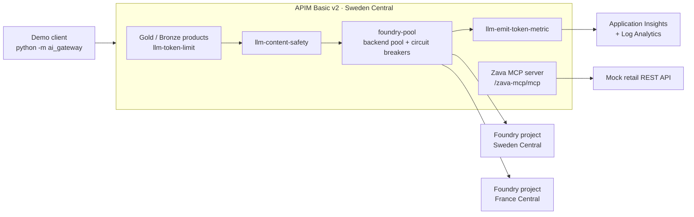

# Demo runbook

Two live demos, each with exact steps, what to say, expected results, and fallbacks.

| Demo | Slot | Duration | Asset |
| --- | --- | --- | --- |
| Demo 1 — Foundry Guide | Section 4 (00:40–00:55) | 15 min | This repo (`frkim/foundry-demo`), deployed to `rg-foundrydemo-dev-swc` |
| Demo 2 — AI Gateway | Section 6 (01:05–01:15, demo part ≈ 7 min) | 10 min incl. intro | <https://github.com/frkim/apim-demo>, deployed to `rg-apimaigw-demo-swc` |

> **Golden rules.** Public data only. Say GA/preview labels out loud. If something fails, narrate it, give it one
> retry, then switch to the fallback within 30 seconds — the story matters more than the click.

---

## Pre-demo setup

### Tools on the presentation laptop

| Tool | Check |
| --- | --- |
| Azure CLI | `az version` |
| GitHub CLI | `gh auth status` |
| Python 3.12+ (for apim-demo client) | `py -3.12 --version` |
| Browser | Signed in to the Azure portal and <https://ai.azure.com> with an account that can read the project and Application Insights |
| Local video player | Opens `docs/video/foundry-demo.mp4` offline |

### Deploy Foundry Guide (T-1 day, re-check T-1 hour)

```powershell
az login
az account set --subscription '<subscription-id>'

# Run the deployment workflow (Bicep + image build + new Container Apps revision)
gh workflow run deploy.yml --repo frkim/foundry-demo --ref main
Start-Sleep -Seconds 10
$runId = gh run list --repo frkim/foundry-demo --workflow deploy.yml --limit 1 --json databaseId --jq '.[0].databaseId'
gh run watch $runId --repo frkim/foundry-demo --exit-status

# Resolve the app URL (https://<containerAppFqdn>) and check health
$fqdn = az containerapp show -n ca-foundrydemo-dev -g rg-foundrydemo-dev-swc --query properties.configuration.ingress.fqdn -o tsv
"https://$fqdn"
curl.exe -s "https://$fqdn/health/live"
curl.exe -s -i "https://$fqdn/health/ready"
curl.exe -s "https://$fqdn/api/info"
```

| Endpoint | Expected |
| --- | --- |
| `GET /health/live` | `200 {"status":"live"}` |
| `GET /health/ready` | `200` when configuration is present **and** the agent is ready; `503` otherwise |
| `GET /api/info` | Endpoint host, models (`gpt-5.4-mini`, `gpt-5.4-nano`), agent `foundry-guide` + version, app version (git SHA), region |

**Optional — avoid cold starts during the session.** The app scales to zero. To keep one replica warm for the session:

```powershell
az containerapp update -n ca-foundrydemo-dev -g rg-foundrydemo-dev-swc --min-replicas 1
# After the session (or let the next deploy.yml run restore the Bicep value):
az containerapp update -n ca-foundrydemo-dev -g rg-foundrydemo-dev-swc --min-replicas 0
```

**Quota check.**

```powershell
az cognitiveservices usage list --location swedencentral -o table
$acct = az cognitiveservices account list -g rg-foundrydemo-dev-swc --query "[0].name" -o tsv
az cognitiveservices account deployment list -g rg-foundrydemo-dev-swc -n $acct -o table
```

### Deploy apim-demo (T-1 day)

From the apim-demo repository (see its README for client configuration):

```powershell
git clone https://github.com/frkim/apim-demo.git
cd apim-demo
az login
az account set --subscription '<subscription-id>'
az deployment sub what-if -n apimaigw-demo -l swedencentral -f infra\main.bicep --result-format ResourceIdOnly
az deployment sub create  -n apimaigw-demo -l swedencentral -f infra\main.bicep
# Alternative: run the repo's "Deploy AI Gateway demo" GitHub Actions workflow.

cd demo
py -3.12 -m venv .venv
.\.venv\Scripts\Activate.ps1
pip install -r requirements.txt     # uses the workstation's configured package feed
python -m ai_gateway chat           # smoke test
```

> The demo model in apim-demo is set by its `modelName` parameter (currently `gpt-6.1-sol`, version `2026-09-29`, per
> the repo). Confirm the model is available in your subscription and regions before the event **[verify]**.

---

## Demo 1 — Foundry Guide (15 min)

**Story:** a prompt agent (`foundry-guide`, model `gpt-5.4-mini`) with two tools — the Microsoft Learn MCP server and
Code Interpreter — called keylessly from a Container App, traced to Application Insights, deployed by Bicep + GitHub
Actions.

### Timeline

| Min | Step | Screen |
| --- | --- | --- |
| 0:00–1:00 | 1. Set the scene | Foundry Guide → About |
| 1:00–4:00 | 2. Learn MCP question | Agent chat |
| 4:00–6:30 | 3. Code Interpreter cost calculation | Agent chat |
| 6:30–8:00 | 4. Resource vs project (same conversation) | Agent chat |
| 8:00–10:00 | 5. Model compare mini vs nano | Model compare |
| 10:00–11:00 | 6. Run history | Run history |
| 11:00–12:30 | 7. Agent in the Foundry portal | ai.azure.com |
| 12:30–14:00 | 8. Traces | Application Insights / Foundry observability |
| 14:00–15:00 | 9. Bicep + GitHub Actions | GitHub |

### Step 1 — Set the scene (1 min)

1. Switch to the browser tab `https://<containerAppFqdn>`.
2. Click the **About** tab (`tab-about`) to show the architecture.
3. Optional: click the theme toggle (`theme-toggle`) for the room's lighting (dark mode usually projects better).

**Say:** "Single container on Azure Container Apps — Vue front end, FastAPI back end. It calls our Foundry project with a
user-assigned managed identity. No API keys anywhere; local auth is disabled on the Foundry resource."

### Step 2 — Learn MCP question (3 min)

1. Click the **Agent chat** tab (`tab-agent`).
2. Click the first suggested prompt (`suggestion-0`), or type into `prompt-input`:

   > What is the difference between prompt agents and hosted agents in Microsoft Foundry Agent Service? Cite Microsoft Learn.

3. Click **Send** (`send-btn`).

**Say while it runs (10–25 s):** "The agent decides to call the Microsoft Learn MCP server — public, read-only, no
credentials. That's why we let it run without approval; for any tool that writes data, keep approvals on."

**Expected result**

| Element | Expected |
| --- | --- |
| Answer (`assistant-message`) | Prompt agents = instructions + model + tools, Foundry-managed; hosted agents = your own code/framework in a managed container |
| Tool-call chips | At least one MCP chip with server label `microsoft_learn` |
| Citations | Markdown links to `learn.microsoft.com` |
| Footer | Latency and token usage |

**Point at:** the tool chips and the citations — "grounded, not guessed".

### Step 3 — Code Interpreter cost calculation (2.5 min)

1. Click `suggestion-1`, or type:

   > Use Code Interpreter. An agent handles 2,000 conversations per day; each uses 1,500 input tokens and 500 output
   > tokens. With illustrative prices of $0.40 per 1M input tokens and $1.60 per 1M output tokens, calculate the daily,
   > 30-day, and 365-day cost. Show a table and a bar chart.

2. Click **Send**.

**Say:** "LLMs are unreliable at arithmetic, so the instructions say: use Code Interpreter for any number. And these
prices are **illustrative** — not list prices. Always check the Azure pricing page for real numbers."

**Expected result** (sanity-check the agent's numbers):

| Period | Input tokens | Output tokens | Cost |
| --- | --- | --- | --- |
| Day | 3,000,000 → $1.20 | 1,000,000 → $1.60 | **$2.80** |
| 30 days | 90M → $36.00 | 30M → $48.00 | **$84.00** |
| 365 days | 1,095M → $438.00 | 365M → $584.00 | **$1,022.00** |

Tool chip for **Code Interpreter**; a Markdown table; a chart if the UI renders the generated file (if it doesn't,
say "the chart was saved as a PNG in the sandbox" and move on).

### Step 4 — Resource vs project, same conversation (1.5 min)

1. Click `suggestion-2`, or type (same conversation — do not reload the page):

   > In Microsoft Foundry, what is the difference between a Foundry resource and a Foundry project? Which one owns
   > networking and model deployments?

2. Click **Send**.

**Say:** "Same conversation — Foundry keeps the conversation state server-side, so follow-ups have context. And here's
the one-liner from the platform section, now straight from the docs."

**Expected result:** the resource is the top-level Azure resource where you manage governance (networking, security,
model deployments); the project is the development boundary where teams build and evaluate. MCP chip + Learn links.

> ⏱ **If late:** skip step 4.

### Step 5 — Model compare: gpt-5.4-mini vs gpt-5.4-nano (2 min)

1. Click the **Model compare** tab (`tab-compare`).
2. Type into `compare-input`:

   > In three bullets, explain why teams put an AI gateway in front of their models.

3. Click **Compare** (`compare-btn`).

**Say:** "Same prompt, both deployments in parallel. Compare latency and tokens. For many tasks the smaller model is
good enough — and you only know if you measure, ideally with evaluations."

**Expected result:** two side-by-side cards (`gpt-5.4-mini`, `gpt-5.4-nano`), each with output, latency (ms), input and
output tokens. Do **not** promise which model is faster before you click; comment on what the cards show.

### Step 6 — Run history (1 min)

1. Click the **Run history** tab (`tab-history`).
2. In `history-table`: sort by **latency** (click the column header), type `compare` in search, clear it, filter by
   kind if available, show pagination.

**Say:** "Every call we made: time, kind, model or agent, latency, tokens, status. It's in memory for the demo — in
production the same signals live in Application Insights."

### Step 7 — The agent in the Foundry portal (1.5 min)

1. Switch to <https://ai.azure.com>; make sure project **`proj-foundrydemo-dev`** is selected.
2. Open **Agents** in the project navigation and select **`foundry-guide`** (menu labels can shift — the portal is
   evolving).
3. Show: the agent **version(s)**, the **model** `gpt-5.4-mini`, the **instructions**, and the two **tools** (MCP
   `microsoft_learn`, Code Interpreter).
4. Optional: show the deployments `gpt-5.4-mini` and `gpt-5.4-nano` (GlobalStandard) in the project's models list.

**Say:** "The agent is a versioned asset in the project. The app creates a new version only when the definition
changes — so you always know what's running."

### Step 8 — Traces (1.5 min)

**Option A — Application Insights (primary):**

1. Azure portal → **`appi-foundrydemo-dev`** → **Transaction search** → last 30 minutes.
2. Open the `POST /api/agent/chat` request → **end-to-end transaction** view.
3. Point out the request span, the outbound call to the Foundry project (Responses API), and agent/tool spans emitted by
   the OpenAI/agents instrumentation.

Optional query in **Logs**:

```kusto
dependencies
| where timestamp > ago(30m)
| summarize calls = count(), avg_ms = avg(duration) by name, target
| order by calls desc
```

**Option B — Foundry observability:** in the agent's page in ai.azure.com, open its traces/monitoring view if available
in your portal version (tracing and the monitoring dashboard are **preview**).

**Say:** "Tracing is OpenTelemetry. When someone says 'the agent gave a weird answer', this is where you start —
which tool it called, how long it took, how many tokens."

> Telemetry can take 1–3 minutes to appear. Run a chat **during the warm-up** so there is already a trace to show.

### Step 9 — Bicep + GitHub Actions (1 min)

1. Switch to GitHub → `frkim/foundry-demo` → `infra/main.bicep` (subscription scope) → `infra/modules/foundry.bicep`:
   point at `kind: 'AIServices'`, `allowProjectManagement: true`, `disableLocalAuth: true`, the project, and the two
   deployments.
2. Switch to **Actions** → last **`deploy.yml`** run: Bicep deploy → image build/push to ACR → new revision.

**Say:** "This is how it got here — one workflow, no keys at runtime. We'll come back to it in the DevOps section."

### Demo 1 — failure fallbacks

| Symptom | Likely cause | Fallback (≤ 30 s) |
| --- | --- | --- |
| Error / HTTP 429 in chat or compare | Model quota or rate limit (capacity 50 per deployment) | "This is exactly why we need an AI gateway — hold that thought." Wait 20–30 s and retry once; else use the **Model compare** tab (lighter) or play the video segment |
| Chat hangs, no MCP chip, or MCP error | Microsoft Learn MCP server slow/unreachable | Retry once. Then ask a question that needs no tools (agent still answers from the model, ADR-0004); show the cited answer in the video |
| Code Interpreter error | Tool/regional issue | Show the expected table above on screen and say "here's what it computes"; or play the video segment |
| `/health/ready` = 503 | Agent not created (config/RBAC) | Model compare still works live; use the video for agent chat; show the agent in the portal if it exists |
| First request very slow | Cold start (scale to zero) | Talk over it; use the warm-up and optional `--min-replicas 1` next time |
| Foundry portal / App Insights slow | Portal load | Use screenshots in the deck backup slides, or the video |
| Network down | Venue network | Switch to phone hotspot; if still down, **play `docs/video/foundry-demo.mp4`** from local disk and narrate live |

---

## Demo 2 — AI Gateway (10 min)

**Story:** APIM Basic v2 governs model and tool traffic for two Foundry projects. Based on `frkim/apim-demo`, whose
README describes: Bicep deploying API Management Basic v2, two current Foundry resources and projects, token budgets,
content safety, MCP tooling, and observability; and a Python client proving keyless chat, load balancing, throttling,
safety enforcement, MCP tools, a Responses API agent flow, and token telemetry.



### Timeline

| Min | Step | Command |
| --- | --- | --- |
| 0:00–2:30 | Intro slides (policies, Foundry + APIM) — see narrative § 6 | — |
| 2:30–3:30 | 1. Architecture + keyless chat | `python -m ai_gateway chat` |
| 3:30–5:00 | 2. Load balancing across the backend pool | `python -m ai_gateway load-balance` |
| 5:00–6:30 | 3. Token limit → 429 | `python -m ai_gateway token-limit` |
| 6:30–7:15 | 4. Content safety | `python -m ai_gateway content-safety` |
| 7:15–8:30 | 5. MCP via APIM | `python -m ai_gateway mcp` |
| 8:30–9:30 | 6. Token metrics | `python -m ai_gateway metrics` |
| 9:30–10:00 | 7. Semantic cache (conditional) + wrap-up | — |

All commands run from the apim-demo `demo` folder with the virtual environment activated.

### Step 1 — Keyless chat through the gateway (1 min)

```powershell
python -m ai_gateway chat
```

**Say:** "The client calls APIM's inference API at `/inference/openai/v1` — keyless — and APIM forwards to Foundry
using its own managed identity. Developers call one endpoint; the platform team owns the policies."

**Expected:** a model response returned through APIM.

### Step 2 — Load balancing / backend pool (1.5 min)

```powershell
python -m ai_gateway load-balance
```

**Say:** "Behind the gateway is a backend pool called `foundry-pool` with circuit breakers, spreading traffic across
two Foundry projects — Sweden Central and France Central. If one backend is throttled, the circuit breaker trips and
traffic goes to the other, honoring `Retry-After`."

**Expected:** several calls; the client output shows how calls were served across the pool (read the output aloud — do
not predict an exact distribution).

### Step 3 — Token limit → HTTP 429 (1.5 min)

```powershell
python -m ai_gateway token-limit
```

**Say:** "Gold and Bronze products have different token budgets enforced by `llm-token-limit`. I'm pushing past the
budget … and there's the **429**. Exceeding the tokens-per-minute rate gives 429; exceeding a total token quota gives
403. The gateway protected the model — and the bill."

**Expected:** successful calls followed by HTTP 429 responses.

### Step 4 — Content safety (45 s)

```powershell
python -m ai_gateway content-safety
```

**Say:** "`llm-content-safety` scores harm categories and can detect jailbreak attempts with Prompt Shields, at the
gateway, before the prompt reaches the model. Blocked requests get a 403."

**Expected:** a blocked request (403) reported by the client.

### Step 5 — MCP via APIM (1.25 min)

```powershell
python -m ai_gateway mcp
```

**Say:** "APIM also exposes a **Zava MCP server** at `/zava-mcp/mcp`, fronting a mocked retail REST API. Exposing REST
APIs as MCP servers in API Management is GA; same gateway, same policies, same telemetry — for tools, not just models."

**Expected:** the client lists/calls MCP tools through APIM and prints results.

> Optional if ahead of time: `python -m ai_gateway agent` — the repo's Responses API agent flow through the gateway.

### Step 6 — Token metrics (1 min)

```powershell
python -m ai_gateway metrics
```

**Say:** "`llm-emit-token-metric` sends prompt, completion, and total tokens to Application Insights with custom
dimensions — product, subscription, backend. That's your chargeback and FinOps data."

**Expected:** token telemetry summary from the client. Optionally open the APIM's Application Insights and run the KQL
from the repo's `docs/narrative` FAQ.

### Step 7 — Semantic cache (conditional, 30 s)

The apim-demo summary does **not** list semantic caching. **If your deployment includes** the
`llm-semantic-cache-lookup` / `llm-semantic-cache-store` policies (they need an embeddings deployment and Azure Managed
Redis with RediSearch), send the same question twice and point at the faster, cached second response. **Otherwise**,
show the slide and point to the [`semantic-caching`](https://github.com/Azure-Samples/AI-Gateway) lab in
Azure-Samples/AI-Gateway.

**Wrap-up say:** "Token budgets, load balancing, safety, MCP, and metrics — one gateway. In Foundry, the AI Gateway pane
can create or attach an API Management v2 instance for you; that pane is in preview."

### Demo 2 — failure fallbacks

| Symptom | Fallback |
| --- | --- |
| Client auth error | `az login` again in the same terminal; re-activate the venv |
| 429 appears too early (step 1/2) | Budget still exhausted from rehearsal — wait a minute for the per-minute window, or switch to the Gold product if the client supports it; narrate it as a live token-limit demo |
| Backend errors on one region | Narrate the circuit breaker; continue with `token-limit` |
| MCP step fails | Show the Zava MCP server configuration in the APIM instance in the Azure portal, or skip — time buffer |
| Nothing works / network | Walk through the architecture diagram and the policy XML in `infra/policies/` (`inference-api.xml`, `product-token-budget.xml`, `retail-mcp.xml`) on GitHub |

---

## Reset steps

### Between rehearsal and the session

| What | How |
| --- | --- |
| New agent conversation | Reload the Foundry Guide page (starts a new conversation) |
| Clear run history (in memory) | Restart the active revision, then warm up again: see commands below |
| Token budgets (apim-demo) | Wait for the per-minute window to pass; quota periods depend on the policy configuration |
| Browser | Close extra tabs, reset zoom, clear the chat input |

```powershell
$rev = az containerapp revision list -n ca-foundrydemo-dev -g rg-foundrydemo-dev-swc --query "[?properties.active].name | [0]" -o tsv
az containerapp revision restart -n ca-foundrydemo-dev -g rg-foundrydemo-dev-swc --revision $rev
$fqdn = az containerapp show -n ca-foundrydemo-dev -g rg-foundrydemo-dev-swc --query properties.configuration.ingress.fqdn -o tsv
curl.exe -s -i "https://$fqdn/health/ready"
```

### After the event (cost hygiene)

```powershell
# Foundry Guide: scale back to zero if you raised min replicas
az containerapp update -n ca-foundrydemo-dev -g rg-foundrydemo-dev-swc --min-replicas 0

# apim-demo: use the repo's "Destroy AI Gateway demo" workflow, or:
az group delete --name rg-apimaigw-demo-swc --yes
# Then purge soft-deleted resources so names and quota are released:
az cognitiveservices account list-deleted -o table
az cognitiveservices account purge --name <account> --resource-group rg-apimaigw-demo-swc --location <region>
az apim deletedservice list -o table
az apim deletedservice purge --service-name <apim-name> --location swedencentral
```

Keep `rg-foundrydemo-dev-swc` if you deliver the session again soon; Container Apps scales to zero, so idle cost is
mainly the registry and monitoring.
