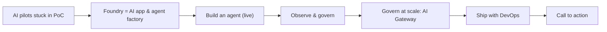

# Narrative — timed talk track (90 minutes)

The spoken script for the session. Read it aloud during rehearsal, then deliver it in your own words — the script is
a safety net, not a teleprompter. Demo steps live in [demo-runbook.md](demo-runbook.md); answers to likely questions
live in [qa-prep.md](qa-prep.md).

**Conventions**

- `[SLIDE]` — advance the deck (`docs/presentations/foundry-session.md` follows the same 8 sections).
- `[CLICK]` / `[SWITCH]` — demo action or window switch.
- **⏱ Time check** — where you should be; if you are late, use the listed cut.
- 🙋 — audience interaction (poll, question, show of hands).
- Dates and statuses are sourced in the research brief; **[verify]** items are not stated as facts here.

## Story arc

| # | Start–End | Section | Arc beat | Buffer cut if late |
| --- | --- | --- | --- | --- |
| 1 | 00:00–00:10 | Opening & why Foundry | PoC purgatory | Shorten the poll debrief |
| 2 | 00:10–00:25 | Platform tour | The factory floor | Skip the migration slide (cover in Q&A) |
| 3 | 00:25–00:40 | Agents | What we build with | Skip memory + Foundry IQ detail |
| 4 | 00:40–00:55 | DEMO 1 — Foundry Guide | Build it | Skip the third prompt |
| 5 | 00:55–01:05 | Observability, evaluations, safety, Control Plane | Observe & govern | Skip red-teaming detail |
| 6 | 01:05–01:15 | AI Gateway + DEMO 2 | Govern at scale | Skip the MCP step |
| 7 | 01:15–01:20 | Deploy & DevOps | Ship it | Show workflow run only |
| 8 | 01:20–01:30 | Roadmap, resources, Q&A | Call to action | Keep at least 5 min of Q&A |

---

## 1 · Opening & why Foundry — 00:00–00:10

**Goal:** Earn attention, name the problem (pilots that never ship), and frame Foundry as the answer.

**Key messages**

- The bottleneck is not the model; it is identity, observability, cost control, and deployment.
- Microsoft Foundry is Microsoft's platform to build, evaluate, and deploy AI apps and agents — the "AI app and agent
  factory".
- Today is end to end and live: build → observe → govern → ship.

**Script**

`[SLIDE: title]`

> Good morning, everyone, and thank you for being here. For the next ninety minutes we're going to do something a bit
> unusual for an AI session: we're going to spend less time on what models can do, and more time on what it takes to
> get them into production.

`[SLIDE: "PoC purgatory"]`

🙋 **Poll (show of hands, 60 s):**
> Quick show of hands. Who here has at least one generative AI pilot in your organization? … Keep your hand up if that
> pilot is running in production today, with real users. … Right. That gap — between all the hands and the few hands
> — is what this session is about.

> When I ask teams why their pilot is stuck, I almost never hear "the model isn't smart enough". I hear four things.
> Security asks: how does this app authenticate, and where are the API keys? The platform team asks: who caps the
> token spend when usage triples? Operations asks: when the agent gives a bad answer, how do I find out why? And
> engineering asks: which model, which version, which prompt is actually running in production right now?
> Those are platform questions, not model questions.

`[SLIDE: "Microsoft Foundry — the AI app & agent factory"]`

> That's where Microsoft Foundry comes in. You may know it by its previous names — Azure AI Studio, then Azure AI
> Foundry; it's now Microsoft Foundry. Microsoft describes it as a managed platform for building, evaluating, and
> deploying generative AI applications and agents. At Build 2025 Microsoft called it "your AI app and agent factory",
> and I like that metaphor, because a factory isn't one machine — it's raw materials, assembly, quality control, and
> shipping. That's exactly our agenda.

`[SLIDE: agenda]`

> Here's the plan. First, a tour of the factory floor: the Foundry resource, projects, models, and the new portal.
> Then agents: the Agent Service, Agent Framework, and tools like MCP. Then I'll build — well, run — an agent live. Then
> we'll observe and govern it, put an AI gateway in front of it, and ship it with Bicep and GitHub Actions. Everything
> you'll see is in a public repo, `frkim/foundry-demo`, and you can deploy it yourself tonight.

`[SLIDE: "Scale" — optional]`

> A bit of context on scale, with dates attached because this space moves fast: at Build 2025 Microsoft reported more
> than 70,000 customers on the platform and 100 trillion tokens processed in a quarter, and today the Learn
> documentation lists more than 10,000 models in the catalog. So this isn't a niche service — it's where a lot of
> production AI on Azure already runs.

**Transition → 2**
> So let's walk onto the factory floor and look at what Foundry is actually made of — because if you've used it a year
> ago, it has changed a lot.

**⏱ Time check:** at 00:10 you are on the "Platform tour" divider. Late by > 2 min → skip the scale slide.

---

## 2 · Platform tour: models, catalog, Foundry resource & projects, new portal — 00:10–00:25

**Goal:** Give everyone the same mental model of the new Foundry and make the "new vs classic" distinction crisp.

**Key messages**

- One **Foundry resource** (`Microsoft.CognitiveServices/accounts`, kind `AIServices`, `allowProjectManagement: true`)
  with child **Foundry projects** replaces hub + separate resources.
- The resource owns governance (networking, security, model deployments); the project is the development boundary.
- New portal (ai.azure.com) works with Foundry projects only; hub-based projects and classic agents live in the classic
  experience.
- Model catalog: 10,000+ models from Microsoft, OpenAI, Anthropic, Meta, and others.

**Script**

`[SLIDE: "Evolution of Foundry"]`

> Let's start with the renames, because they confuse everyone. Azure AI Studio became Azure AI Foundry, which became
> Microsoft Foundry. Azure AI Services are now called Foundry Tools — Speech, Language, Document Intelligence, Content
> Safety and friends. The Assistants API generation of agents gave way to agents on the Responses API. And the
> RBAC roles were renamed too — Azure AI User became Foundry User, and so on — but the role IDs and permissions did not
> change, so your existing assignments keep working.

`[SLIDE: "Resource model"]`

> The most important change is the resource model. In the classic world you had a hub, plus a separate Azure OpenAI
> resource, plus AI Services, plus storage and a key vault you had to wire together. In the new Foundry there's one
> top-level resource. In ARM it's `Microsoft.CognitiveServices/accounts` of kind `AIServices`, and you set
> `allowProjectManagement` to `true`. Under it you create Foundry projects as child resources.
>
> Microsoft's own one-liner is the one I'd memorize: the Foundry **resource** is where you manage governance —
> networking, security, model deployments. The **project** is the development boundary where teams build and evaluate
> use cases. Every project gets an endpoint that looks like
> `https://<resource>.services.ai.azure.com/api/projects/<project>` — that single URL is what your code talks to.

🙋 **Question to the room (30 s):**
> Who's still using hub-based projects today? … That's fine — I'll cover migration in a minute.

`[SLIDE: "New vs classic"]`

> Two portals exist today. The classic Foundry portal shows every resource type, including hubs. The new portal, at
> ai.azure.com, works with Foundry projects only — and the documentation is explicit: new agent and model-centric
> capabilities are only available on Foundry projects, including Foundry Agent Service in general availability.
> Hub-based projects, standalone Azure OpenAI resources, and classic v1 agents are not supported in the new portal.

`[SLIDE: "Migration"]`

> If you're on a hub today, there's a documented migration. It moves model deployments, data files, fine-tuned models,
> and vector stores. It does not move preview agent state — threads, messages, files — open-source model deployments,
> or hub project access. So plan for re-creating agents, not copying them. And put this date in your calendar: classic
> Assistants-API agents are deprecated and retire on March 31, 2027.

`[SLIDE: "Model catalog"]` — optional `[SWITCH: ai.azure.com model catalog]` for 60 s

> The raw material of the factory is models. The catalog lists more than 10,000 models from Microsoft, OpenAI,
> Anthropic, Meta, and others. A few highlights: the GPT-5.x family — today's demo uses `gpt-5.4-mini` as the agent's
> model and `gpt-5.4-nano` as the fast, cheap one; Anthropic's Claude models are available in Foundry, billed through
> Azure Marketplace; and open-weight families like DeepSeek, Llama, Mistral, and Cohere. There's also a Model Router
> that routes across providers from a single deployment — check its current status on Learn before you bet a
> production design on it.
>
> My practical advice: don't pick "the best model". Pick the cheapest model that passes your evaluations — and we'll
> see in the demo how big the latency and token difference between a mini and a nano model can be.

`[SLIDE: "Developer experience"]`

> Finally, the developer surface. The SDK is `azure-ai-projects` 2.x — the Microsoft Foundry SDK — and you get an
> OpenAI client from the project to call the Responses API, authenticated with Microsoft Entra ID. No API keys. In VS
> Code there's the Microsoft Foundry Toolkit — the evolution of the AI Toolkit — and for GitHub Copilot there's a
> Microsoft Foundry Skill that teaches Copilot how to deploy models, build agents, and run evaluations.

**Transition → 3**
> So that's the factory floor: one resource, projects, a huge model catalog, and a new portal. But nobody comes to a
> factory to admire the floor. Let's talk about what we build on it — agents.

**⏱ Time check:** at 00:25 you are on the "Agents" divider. Late → skip the Developer experience slide (it reappears in
section 8).

---

## 3 · Agents: Agent Service, Agent Framework, tools, MCP, A2A, memory, hosted agents — 00:25–00:40

**Goal:** Explain the agent options and tools clearly, with GA/preview status, so the demo makes sense.

**Key messages**

- Foundry Agent Service on the Responses API is **GA** (March 16, 2026); it's wire-compatible with OpenAI agents.
- Two main agent types: **prompt agents** (instructions + model + tools, no infra) and **hosted agents** (your code,
  your framework, in a managed container) — both GA.
- Tools: Code Interpreter, File Search, web grounding, Azure AI Search, OpenAPI, Functions, **MCP**, **A2A** — GA;
  several newer tools are still preview.
- Microsoft Agent Framework 1.0 is the successor to Semantic Kernel + AutoGen; native Foundry Workflows retire
  December 1, 2026.

**Script**

`[SLIDE: "Foundry Agent Service"]`

> There have been two GA moments for the Agent Service, and it's worth not mixing them up. The first, at Build 2025,
> was the classic, Assistants-API-based service — the one that's now deprecated. The second, on March 16, 2026, is the
> one that matters: the next-generation Foundry Agent Service, built on the **Responses API**, wire-compatible with
> OpenAI agents, with evaluations GA alongside it. That's what we're using today.

`[SLIDE: "Agent types"]`

> You'll meet two main agent types. **Prompt agents** are declarative: instructions, a model, a list of tools. Foundry
> runs them, there's no infrastructure — that's what our demo agent is. **Hosted agents** are for when you need your own
> code: you bring Agent Framework, LangGraph, the OpenAI Agents SDK, and others, and Foundry runs it as a managed
> container. Hosted agents are generally available. And voice-based prompt agents through Voice Live are GA as well.

`[SLIDE: code — create_version]`

> Here's what defining a prompt agent looks like in our repo. It's the Foundry SDK 2.x: `agents.create_version` with a
> `PromptAgentDefinition` — model `gpt-5.4-mini`, the instructions, and two tools: an MCP tool pointing at the public
> Microsoft Learn MCP server, and Code Interpreter. Versions matter: every change creates a new agent version, so you
> always know what's running. Our app only creates a new version when the definition's fingerprint changes.
>
> To call it, we use the OpenAI client from the project, create a conversation, and call the Responses API with an
> agent reference. That's it — no threads, no runs, no polling loop like the old Assistants API.

`[SLIDE: "Tool catalog"]`

> Tools are what make an agent useful. Generally available today: function calling, Code Interpreter, File Search, web
> grounding with Bing, Azure AI Search, OpenAPI tools, Azure Functions, MCP tools, the A2A tool, and Toolbox. Still in
> preview: SharePoint and Fabric connectors, browser automation, computer use, image generation, Skills as a platform
> object, and the deep research tool. Rule of thumb: build production on GA, experiment on preview.

`[SLIDE: "MCP"]`

> MCP — the Model Context Protocol — deserves its own slide. It's the standard way to plug tools into agents. In
> Foundry you point the MCP tool at a remote server; ours is `learn.microsoft.com/api/mcp`, which is public, read-only,
> and needs no credentials. By default, MCP tool calls require approval — the run pauses until your client approves.
> We set `require_approval` to `never` here *only* because the server is read-only over public docs. For anything that
> writes data, keep approvals on. And if you want to share a curated set of tools across many agents, **Toolbox** lets
> you define them once and expose them through a single MCP-compatible endpoint.

`[SLIDE: "A2A, memory, knowledge"]`

> Agents also talk to agents. The **A2A tool**, on protocol v1.0, is GA for outbound calls — your Foundry agent calling
> another agent. Exposing a Foundry agent as an incoming A2A endpoint is in preview. Memory — user profile, chat
> summary, and procedural memory — is in **preview**, so treat it as experimental. And for knowledge, **Foundry IQ**
> became GA at Build 2026 as the knowledge layer: agentic retrieval over Azure AI Search, exposed to agents through MCP.

`[SLIDE: "Agent Framework"]`

> Last piece: code-first orchestration. **Microsoft Agent Framework** is the open-source SDK that unifies Semantic
> Kernel's enterprise foundations with AutoGen's orchestration. It reached version 1.0 on April 3, 2026, with
> long-term support, in Python and .NET. Why does that matter? Because the native visual Workflows feature in Foundry
> is retiring on December 1, 2026, and Microsoft's guidance is explicit: for new workflows, use Agent Framework. If
> you're starting today on Semantic Kernel or AutoGen, plan for Agent Framework.

🙋 **Poll (30 s):**
> Show of hands — who has built something with Semantic Kernel or AutoGen? … Good: your concepts carry over.

`[SLIDE: "Publish"]`

> And once an agent is ready, publishing it to Microsoft 365 Copilot and Teams is GA, straight from the Foundry
> portal. That's how a developer's agent reaches business users.

**Transition → 4**
> Enough slides. Let me show you an agent that uses exactly these pieces — a prompt agent, an MCP tool, Code
> Interpreter, the Responses API, and managed identity — running on Azure right now.

**⏱ Time check:** at 00:40 you switch to the browser. Late → cut the "Publish" slide and the A2A detail.

---

## 4 · DEMO 1 — Foundry Guide agent — 00:40–00:55

**Goal:** Prove it's real: a grounded agent with tools, model comparison, run history, portal view, traces, and the
deployment pipeline.

**Key messages**

- A prompt agent with an MCP tool and Code Interpreter answers grounded, cited questions and does real math.
- Model choice is a cost/latency decision you can measure.
- The agent is a versioned asset visible in the Foundry portal; every call is traced.

**Script** — follow [demo-runbook.md § Demo 1](demo-runbook.md#demo-1--foundry-guide-15-min) for exact clicks.

`[SWITCH: Foundry Guide, About tab]`

> This is Foundry Guide. It's a single container on Azure Container Apps: a Vue front end and a FastAPI back end. The
> back end calls our Foundry project using a user-assigned managed identity — there isn't a single API key in this
> system; we even disabled local auth on the Foundry resource.

`[CLICK: Agent chat → suggestion 0 (Learn MCP question)]`

> First question: something the model might not know because it's newer than its training data. Watch the chips
> under the answer — that's the agent calling the Microsoft Learn MCP server … and here are the citations, with Learn
> links. Grounded, not guessed.

`[CLICK: suggestion 1 (cost calculation)]`

> Second: math. LLMs are famously unreliable at arithmetic, so the agent's instructions say: use Code Interpreter for
> any number. You see the Code Interpreter chip — it wrote and ran Python in a sandbox. And note: the prices in my
> prompt are illustrative, not list prices.

`[CLICK: suggestion 2 (resource vs project) — same conversation]`

> Third, a follow-up in the same conversation — a Foundry conversation keeps the context server-side. And this is the
> one-liner from twenty minutes ago, now coming from the docs.

`[CLICK: Model compare tab]`

> Now the economics. Same prompt, two deployments in parallel: `gpt-5.4-mini` and `gpt-5.4-nano`. Look at the
> latency and token counts side by side. For a lot of tasks, the smaller model is good enough — and you only know that
> if you measure.

`[CLICK: Run history tab]`

> Every call we just made is here — kind, model or agent, latency, tokens, status. Sort by latency … This is in-memory
> for the demo; in production you'd look at the same data in Application Insights.

`[SWITCH: ai.azure.com → Agents → foundry-guide]`

> Here's the same agent in the Foundry portal: its versions, its model, its two tools. This is the asset, governed in
> the project.

`[SWITCH: Application Insights → transaction]`

> And here's the trace of the chat we just ran: the HTTP request, the call to the Responses API, the agent and tool
> spans. When someone says "the agent gave a weird answer", this is where you start.

`[SWITCH: GitHub → infra/main.bicep, Actions → deploy.yml]`

> Last, how it got here: Bicep at subscription scope and a GitHub Actions workflow. We'll come back to this in the
> DevOps section.

🙋 **Interaction (if ahead of time):**
> What should I ask it? Give me a Foundry question — keep it public, please.

**Transition → 5**
> So we built — or rather ran — an agent in a few minutes. That's the easy part. The hard part is the question from the
> beginning: when it misbehaves, how do you know, and how do you stop it? Let's talk about observing and governing.

**⏱ Time check:** at 00:55 you are back in the deck. Late → skip the third prompt and the Bicep tab (section 7 covers it).

---

## 5 · Observability, evaluations, safety, Foundry Control Plane — 00:55–01:05

**Goal:** Show how Foundry makes agents observable, measurable, and safe — with honest preview/GA labels.

**Key messages**

- Tracing is OpenTelemetry-based into Application Insights (preview); evaluations are GA; continuous evaluation and
  the monitoring dashboard are preview.
- Guardrails: core framework GA; agent tool-call/tool-response interventions are preview; Prompt Shields GA.
- Red teaming with the AI Red Teaming Agent (built on PyRIT) — check status before you rely on it.
- Governance: Foundry Control Plane, Purview, Defender for Cloud, Entra Agent ID.

**Script**

`[SLIDE: "Observe"]`

> Microsoft calls this pillar Foundry Observability. Tracing is OpenTelemetry-based: once Application Insights is
> connected, server-side traces are logged automatically and kept for 90 days, and on the client side — like in our
> app — you use the Azure Monitor OpenTelemetry exporter. Because it's OpenTelemetry, you can also ship to other OTLP
> back ends. Tracing is still labeled preview, and it's off by default — so turn it on on day one, not after the first
> incident. There's also an agent monitoring dashboard in preview: token usage, latency, success rate, evaluation
> scores.

`[SLIDE: "Evaluate"]`

> Evaluations went GA together with the Agent Service in March 2026. My advice: write evaluations before you change
> the model or the prompt — that's how you safely move from mini to nano, or to the next model version. Continuous
> evaluation, which re-runs evaluations on a schedule, is in preview.

🙋 **Question to the room (30 s):**
> Who has an automated evaluation running in CI for an AI feature today? … That's the number I'd like to see go up.

`[SLIDE: "Protect"]`

> Safety. Foundry has a guardrails and controls framework that's GA. It can intervene on user input, on tool calls, and
> on tool responses — the last two, the agent guardrails, are in preview. Prompt Shields detect jailbreaks and prompt
> injection and are GA. Spotlighting, which marks lower-trust content like documents to defend against indirect
> attacks, is in preview. And for testing, the AI Red Teaming Agent, built on the open-source PyRIT toolkit, measures an
> attack success rate against your agent; its agentic-risk categories run in a handful of regions, including Sweden
> Central where our demo lives.

`[SLIDE: "Govern — Foundry Control Plane"]`

> Governance across many agents is the Foundry Control Plane. Three integrations I'd highlight. Microsoft Purview: a
> toggle in the Foundry portal enables audit, data classification, DSPM for AI, and eDiscovery for agent interactions.
> Microsoft Defender for Cloud: threat protection for AI agents, in preview since February 2026. And Microsoft Entra
> Agent ID, which gives agents their own identities with lifecycle governance and audit. You can even register
> externally hosted A2A agents in the Control Plane, so governance isn't limited to what runs in Foundry.

**Transition → 6**
> All of that governs one agent or one project. But in a real company, you'll have dozens of apps and agents calling
> models and tools. Who enforces the token budget across all of them? Who load-balances when one region hits its
> quota? That's the job of an AI gateway.

**⏱ Time check:** at 01:05 you are on the "AI Gateway" divider. Late → skip the red-teaming paragraph.

---

## 6 · AI Gateway (Azure API Management) — 01:05–01:15

**Goal:** Show APIM as the governance layer for model and tool traffic, live.

**Key messages**

- APIM's GenAI gateway policies: `llm-token-limit`, `llm-emit-token-metric`, semantic caching, backend pools with
  circuit breakers, `llm-content-safety`.
- APIM can expose and govern MCP servers (GA); Foundry's built-in AI Gateway pane and MCP governance via an AI gateway
  are preview.
- Demo: `frkim/apim-demo` — token budget 429, load balancing across two Foundry projects, content safety, MCP, metrics.

**Script**

`[SLIDE: "Why an AI gateway"]`

> An AI gateway is just API Management with policies that understand tokens. Five you should know. `llm-token-limit`
> caps tokens per minute and total token quota per consumer — you get HTTP 429 when you exceed the rate and 403 when
> you exceed the quota. `llm-emit-token-metric` sends prompt, completion, and total tokens to Application Insights
> with your own dimensions — that's your chargeback. Semantic caching returns a cached answer for similar prompts.
> Backend pools with circuit breakers load-balance across deployments or regions and honor `Retry-After`. And
> `llm-content-safety` enforces content safety at the gateway.

`[SLIDE: "Foundry + APIM"]`

> Two things to know about the Foundry integration. In the Foundry portal there's an AI Gateway pane that creates or
> attaches an API Management v2 instance — that's in preview. And on the tool side, APIM can expose a REST API as an
> MCP server or pass through an existing MCP server — that's GA — while Foundry's "govern MCP tools with an AI gateway"
> layer on top is in preview.

`[SWITCH: terminal — apim-demo]` — follow [demo-runbook.md § Demo 2](demo-runbook.md#demo-2--ai-gateway-10-min)

> This is `frkim/apim-demo`: API Management Basic v2 in front of two Foundry projects, one in Sweden Central and one in
> France Central, with Gold and Bronze products that have different token budgets.

> `[RUN: chat]` A keyless chat through the gateway. `[RUN: load-balance]` Several calls, spread across the backend pool.
> `[RUN: token-limit]` Now I hammer it with the Bronze budget … and there's the 429. The gateway protected the model and
> my bill. `[RUN: content-safety]` A prompt that the content-safety policy blocks. `[RUN: mcp]` And tools: an MCP server,
> fronted by APIM, that the agent can call — same policies, same telemetry. `[RUN: metrics]` Finally, token metrics,
> per product, in Application Insights.

🙋 **Question to the room (20 s):**
> Who already runs API Management for regular APIs? … Then you already own most of an AI gateway.

**Transition → 7**
> We've built it, observed it, and governed it. The last mile is the one that kills most pilots: shipping it
> repeatably. Five minutes on DevOps.

**⏱ Time check:** at 01:15 you are on the "Deploy & DevOps" divider. Late → skip the MCP step in the demo.

---

## 7 · Deploy & DevOps: Bicep + GitHub Actions + keyless — 01:15–01:20

**Goal:** Show that an AI app ships like any other app — infrastructure as code, CI/CD, no secrets at runtime.

**Key messages**

- Bicep at subscription scope creates everything: resource group, Foundry resource + project + deployments, identity,
  registry, Container Apps, monitoring.
- Keyless: user-assigned managed identity with least-privilege roles, `disableLocalAuth: true`.
- GitHub Actions: CI on every PR, deploy on `main` / manual dispatch; prefer OIDC federation over stored secrets.

**Script**

`[SLIDE: "Ship it"]` then `[SWITCH: GitHub → infra/]`

> Everything you saw is in `infra/`. `main.bicep` runs at subscription scope and creates the resource group. The
> Foundry module creates the resource — kind `AIServices`, `allowProjectManagement` true, `disableLocalAuth` true —
> the project, and two GlobalStandard deployments, created one after the other. Then a user-assigned identity, a
> container registry with admin disabled, Container Apps, Log Analytics, and Application Insights, all tagged.

> Identity is the heart of it. The app's managed identity gets exactly two roles: Azure AI User — now called Foundry
> User — on the Foundry resource, and AcrPull on the registry. The code uses `DefaultAzureCredential`. There's no key
> to leak, rotate, or paste into a chat window.

`[SWITCH: Actions → deploy.yml run]`

> The pipeline: CI lints, type-checks, tests, builds the container, and lints the Bicep on every pull request. Deploy
> runs the Bicep, pushes the image, and rolls a new Container Apps revision, which waits on the readiness probe — and
> our readiness probe checks that the agent is ready. One honest note: for GitHub-to-Azure auth, use OIDC workload
> identity federation. This repo documents a temporary, expiring exception in an ADR — that's the pattern: if you must
> deviate, write it down with an expiry date.

**Transition → 8**
> So: build, observe, govern, ship. Let me close with what's coming and what you can do on Monday.

**⏱ Time check:** at 01:20 you are on "Roadmap". Late → show only the workflow run, skip the Bicep walk-through.

---

## 8 · Roadmap, resources, Q&A — 01:20–01:30

**Goal:** Leave the audience with dates to plan around, resources, and a concrete call to action; take questions.

**Key messages**

- Dates to plan around: native Foundry Workflows retire **Dec 1, 2026**; classic (Assistants-API) agents retire
  **Mar 31, 2027**.
- Several capabilities are moving from preview to GA — re-check status before you design around them.
- Call to action: deploy the repo, move one pilot, add a gateway.

**Script**

`[SLIDE: "Dates to plan around"]`

> Two dates. December 1, 2026: the native Workflows feature in Foundry retires — use Microsoft Agent Framework for
> orchestration. March 31, 2027: classic Assistants-API agents retire — move to the Responses-API Agent Service and
> Foundry projects. If you have hub-based projects, start the migration now; the migration guide tells you what moves
> and what you must re-create.

`[SLIDE: "Watch list"]`

> And a watch list of things in preview today that I expect you'll want: agent memory, agent guardrails on tool calls,
> tracing and the monitoring dashboard, continuous evaluation, incoming A2A endpoints, and the Foundry AI Gateway pane.
> Preview means no SLA — fine for learning, think twice for production.

`[SLIDE: "Resources"]`

> Resources: the demo repo `frkim/foundry-demo`; the AI gateway demo `frkim/apim-demo`; the `Azure-Samples/AI-Gateway`
> labs — start with token rate limiting, backend pool load balancing, and token metrics; the Microsoft Learn "What is
> Microsoft Foundry" page; the Foundry Toolkit for VS Code at `aka.ms/foundrytk`; and the Microsoft Foundry Skill for
> GitHub Copilot.

`[SLIDE: "Call to action"]`

> If you remember one thing: your pilot isn't stuck because of the model. Pick one pilot this month. Move it onto a
> Foundry project with managed identity and tracing on. Put a gateway in front of it with a token budget. Ship it with
> a pipeline. Then do the next one — that's what a factory is for.
>
> Thank you. Let's take your questions.

🙋 **Q&A (≥ 5 min):** use [qa-prep.md](qa-prep.md). Repeat each question into the microphone before answering. If
you don't know, say so and offer to follow up — never guess a date or a price.

**⏱ Time check:** finish on time. At 01:28 announce "last question"; at 01:30 close with the resources slide visible.

---

## Delivery notes

| Topic | Guidance |
| --- | --- |
| Pace | ~140 words per minute for scripted parts; slow down for dates and status labels |
| GA vs preview | Always say the label out loud; never present a preview as production-ready |
| Numbers | Always attach the date/era (e.g., "at Build 2025") — do not mix eras |
| Demo failure | Narrate calmly, switch to the fallback in the runbook within 30 s, keep the story going |
| Data | Public data only in the demo — never type customer or confidential data on screen |
